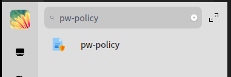
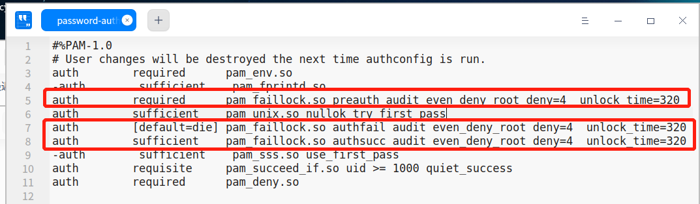
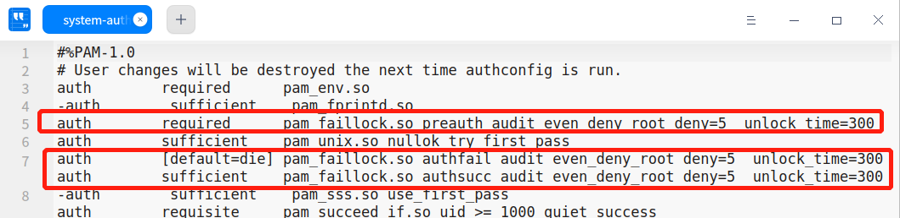

# pw_policy

[TOC]

# 简介

openEuler 使用 pam 做为操作系统的认证模块，普通登陆，ssh登陆等等都会使用pam进行认证。但是pam的配置非常复杂，并且支持可插拔特性，导致运维管理员去配置认证策略非常复杂。期望提供一款易用的dde桌面应用pw_policy，简化密码策略配置。

pw_policy前端使用pyqt开发，后端对pam文件进行修改。

# 功能

pw_policy分成普通登录配置策略、ssh登录配置策略和口令复杂度三部分，配置策略如下：

| ssh登录配置策略             |
| --------------------------- |
| 连续登录最大失败次数        |
| 失败锁定时间                |
| 是否禁止root用户经过SSH登陆 |

| 普通登录配置策略                     |
| ------------------------------------ |
| 是否限制用户登录到root用户           |
| 连续登录最大失败次数，失败后锁定时间 |

| 口令复杂度配置策略                 |
| ---------------------------------- |
| 配置口令最少长度                   |
| 最少字符组合                       |
| 大小写字母、数字、特殊字符最少个数 |
| 修改最多尝试次数                   |
| 不能修改为过去几次内使用过的旧口令 |

# 工具部署

- **Build dependencies**

  python3-devel、python3-setuptools

- **Build**

  ```
  rpmbuild -ba  pw-policy-setup.spec
  ```

- **Install**

  ```
  rpm -ivh pw-policy-xxx.noarch.rpm
  ```

# 工具使用

打开工具：



工具界面：


修改相关配置后，点击配置按钮。

# 策略配置实现

- **ssh登录策略配置**

  /etc/pam.d/sshd使用了password-auth，更改/etc/pam.d/password-auth，根据配置规则在特定位置加入配置行，并设置参数，如图

  

  具体操作为首先删除配置行，之后匹配auth  suffic pam_unix.so，定位所在行，在该行前添加行

  ```shell
  auth        required      pam_faillock.so preauth audit even_deny_root \
  deny={}  unlock_time={}
  ```

  该行后添加行

  ```shell
  auth        [default=die] pam_faillock.so authfail audit even_deny_root \
  deny={}  unlock_time={}
  auth        sufficient    pam_faillock.so authsucc audit even_deny_root \
  deny={}  unlock_time={}
  ```

  ssh禁止root登录实现：/etc/pam.d/sshd中加入auth       required pam_listfile.so item=user sense=deny file=/etc/pam.d/ssh-denyuser onerr=succeed，并新建/etc/pam.d/ssh-denyuser记录要禁止的用户root，也可以继续添加普通用户。

- **用户登录策略配置**

  /etc/pam.d/login使用了system-auth，更改/etc/pam.d/password-auth，根据配置规则在特定位置加入配置行，并设置参数

  

  只允许root和wheel群组的账户使用su命令，通过注释与取消注释/etc/pam.d/su文件中配置行auth  required   pam_wheel.so  use_uid实现。

- **口令复杂度策略配置**

  修改/etc/pam.d/system-auth文件，匹配工作类别为‘password’的行，在该行前增加配置行

  ```shell
  password    requisite     pam_pwquality.so try_first_pass local_users_only \
  minlen={} minclass={} lcredit={} ucredit={} dcredit={} ocredit={} retry={}
  password    requisite     pam_pwhistory.so remember={}
  ```

- **pam文件修改方式**

  按先删除再添加的策略。

  遍历文件第一遍，删除已有的配置行。

  遍历文件第二遍，在特定位置插入配置行。


