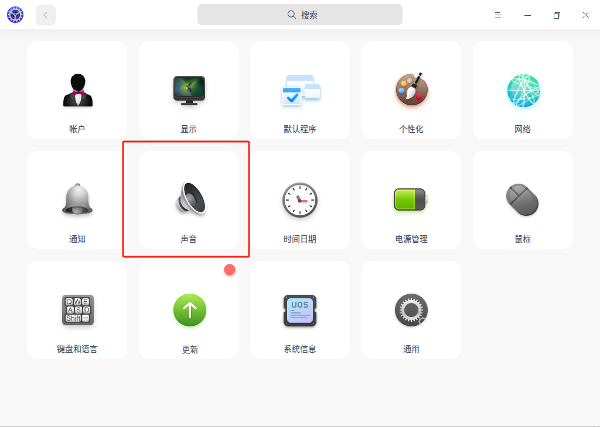
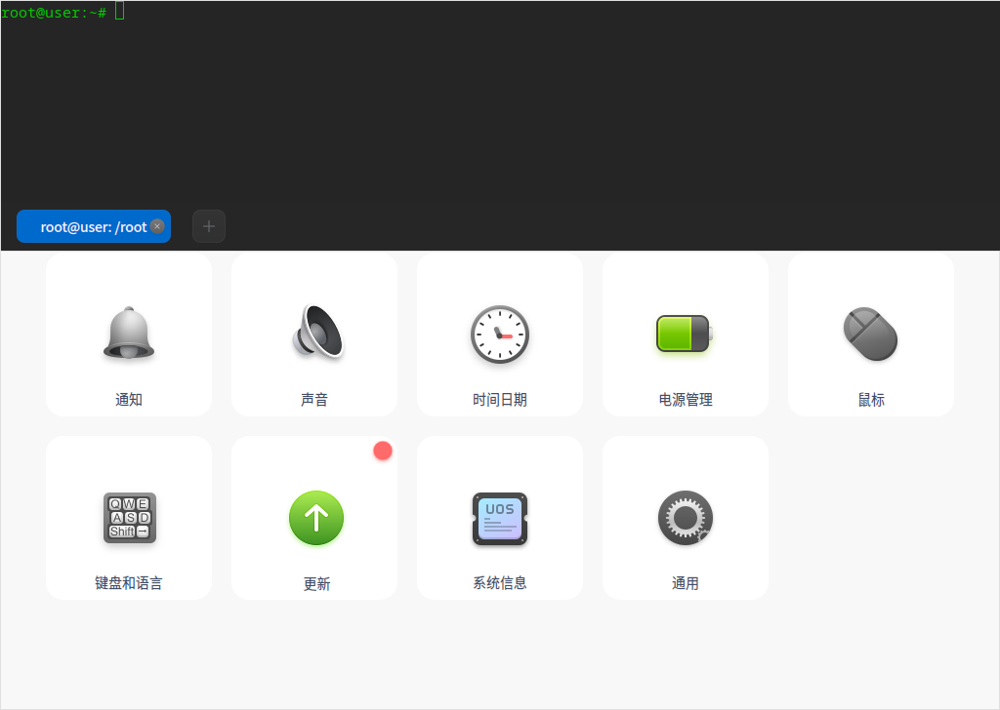
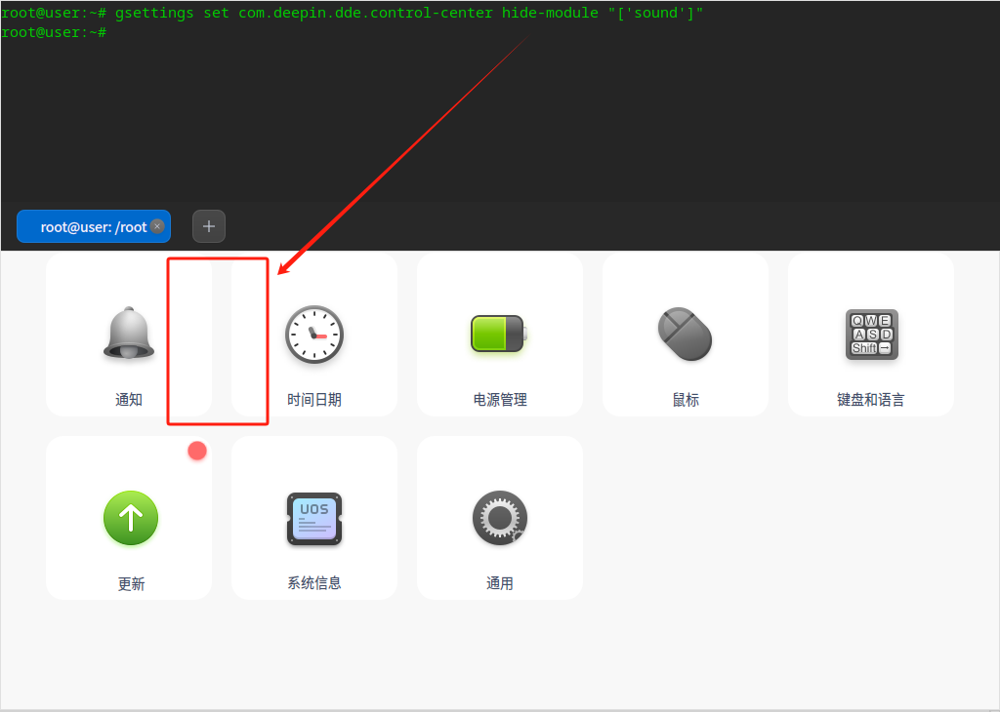
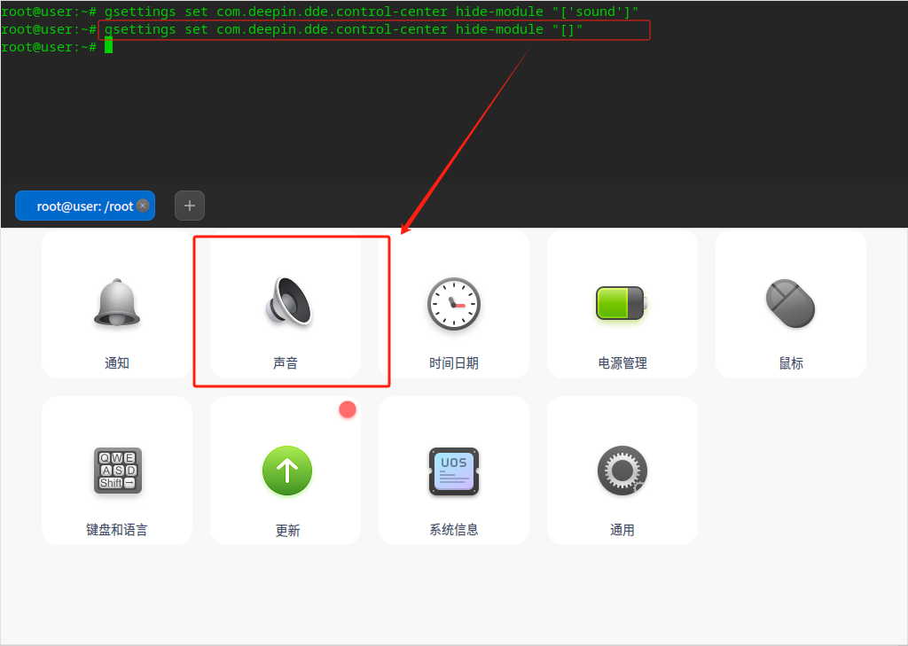

# 标题：控制中心-声音模块隐藏
## 前置条件

1. 启动器可以正常打开；
2. 终端可以正常打开或可以ssh连接到主机执行命令。

<br>


## 用例步骤

| 编号 | 步骤                                                         | 预期                                |
| :--: | ------------------------------------------------------------ | ----------------------------------- |
|  1   | 打开启动器-控制中心。                                        | 可以看到“声音“模块正常显示。        |
|  2   | 右键或通过启动器打开终端或远程到主机。                       | 正常打开终端或远程到主机。          |
|  3   | 隐藏“声音”模块，执行：`gsettings set com.deepin.dde.control-center hide-module "['sound']"` | “启动器-控制中心“不显示“声音”模块。 |
|  4   | 显示“声音”模块，执行：`gsettings set com.deepin.dde.control-center hide-module "[]"` | “启动器-控制中心“显示“声音”模块。   |

<br>


## 测试过程

1. 打开“启动器-控制中心”



<br>


2. 打开终端



<br>


3. 隐藏“声音”模块

```
gsettings set com.deepin.dde.control-center hide-module "['sound']"
```



<br>


4. 显示“声音”模块

```
gsettings set com.deepin.dde.control-center hide-module "[]"
```



<br>


